# Manual de uso — Finance Demo

Guía para recorrer la aplicación: cómo ingresar, cómo moverse, qué muestra cada pantalla y cómo interpretar los números.

> **Importante.** Esta versión es una **demo de solo lectura**. Todo lo que se ve proviene de datos cargados en el entorno de pruebas (Staging). Todavía no se pueden crear, editar ni borrar registros, y nada de lo que se muestra constituye una presentación fiscal ante ARCA.

---

## Contenido

1. [Ingresar a la aplicación](#1-ingresar-a-la-aplicación)
2. [Cómo está organizada la pantalla](#2-cómo-está-organizada-la-pantalla)
3. [Modo negocio y modo contabilidad](#3-modo-negocio-y-modo-contabilidad)
4. [Dashboard en modo negocio](#4-dashboard-en-modo-negocio)
5. [Dashboard en modo contabilidad](#5-dashboard-en-modo-contabilidad)
6. [Cambiar de empresa](#6-cambiar-de-empresa)
7. [Clientes](#7-clientes)
8. [Proveedores](#8-proveedores)
9. [Caja](#9-caja)
10. [Bancos](#10-bancos)
11. [Contabilidad](#11-contabilidad)
12. [Reportes](#12-reportes)
13. [Administración: Empresa, Usuarios y Configuración](#13-administración-empresa-usuarios-y-configuración)
14. [Cómo leer los números](#14-cómo-leer-los-números)
15. [Mensajes que podés ver](#15-mensajes-que-podés-ver)
16. [Preguntas frecuentes](#16-preguntas-frecuentes)

---

## 1. Ingresar a la aplicación

1. Abrí la dirección de la aplicación en el navegador.
2. Escribí tu **Email** y tu **Contraseña**.
3. Hacé clic en **Ingresar**.

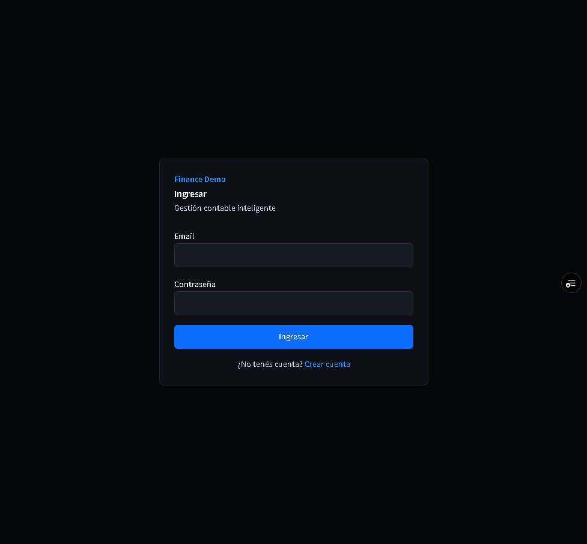

Si intentás abrir una página interna sin haber iniciado sesión, la aplicación te lleva primero a esta pantalla y, después de ingresar, te devuelve a donde querías ir.

Para salir, usá **Cerrar sesión**, al pie del menú lateral.

---

## 2. Cómo está organizada la pantalla

Todas las pantallas internas comparten la misma estructura:

| Zona | Qué contiene |
|---|---|
| **Barra superior** | El selector **Modo negocio / Modo contabilidad** y el botón de tema claro/oscuro (ícono de luna o sol). |
| **Menú lateral** | La empresa activa, el modo actual y los accesos a cada sección. |
| **Contenido** | La sección que elegiste. |

**En pantallas anchas** (monitor o notebook) el menú lateral está siempre visible a la izquierda.
**En pantallas angostas** (tablet, celular o ventana chica) el menú se oculta: tocá el botón **☰** arriba a la izquierda para abrirlo. Para cerrarlo, tocá la **X** en la esquina superior del menú o tocá fuera de él.

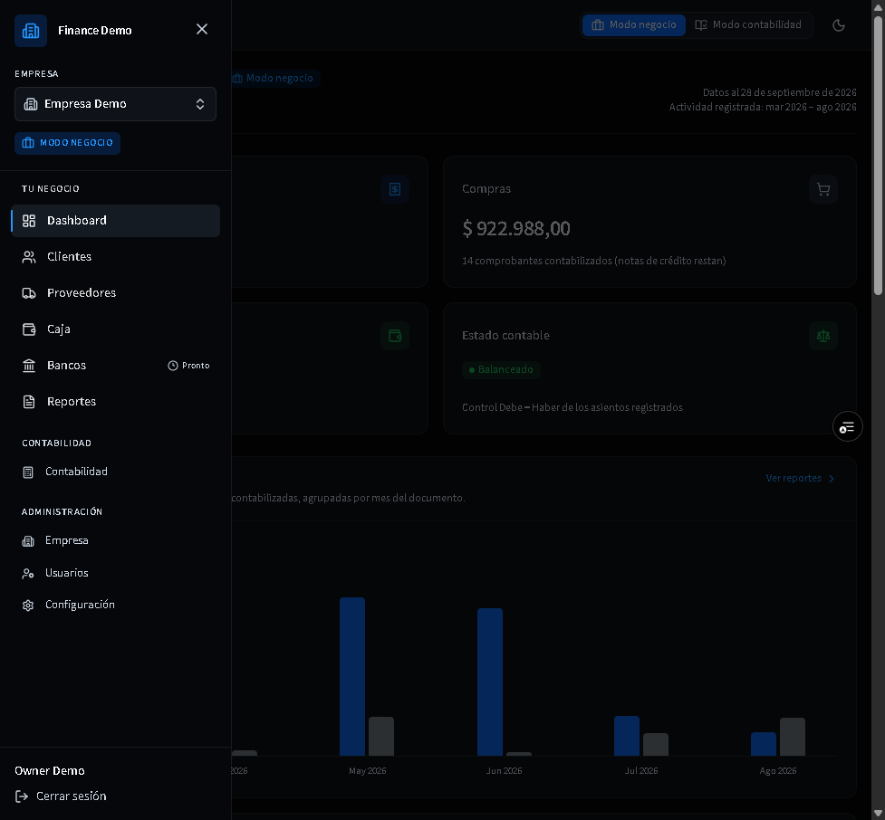

En el menú, la sección donde estás aparece resaltada con una barra de color a la izquierda. **Bancos** muestra la etiqueta **Pronto** porque todavía no está disponible.

---

## 3. Modo negocio y modo contabilidad

La aplicación tiene dos formas de presentarse. **Los datos son los mismos**; lo que cambia es qué se muestra primero y cómo se ordena el menú.

| | **Modo negocio** | **Modo contabilidad** |
|---|---|---|
| Pensado para | Dueños y responsables comerciales | Contadores y administración contable |
| Título del dashboard | "Resumen de tu negocio" | "Resumen contable" |
| Qué destaca | Ventas, compras, caja, clientes y proveedores | Debe, Haber, balance, asientos y períodos fiscales |
| Primeras opciones del menú | Dashboard, Clientes, Proveedores, Caja, Bancos, Reportes | Dashboard, Contabilidad, Reportes |
| Color del modo | Azul | Verde |

### Cómo cambiar de modo

En la barra superior hacé clic en **Modo negocio** o **Modo contabilidad**. El botón activo queda pintado (azul o verde) y la página se actualiza sola.

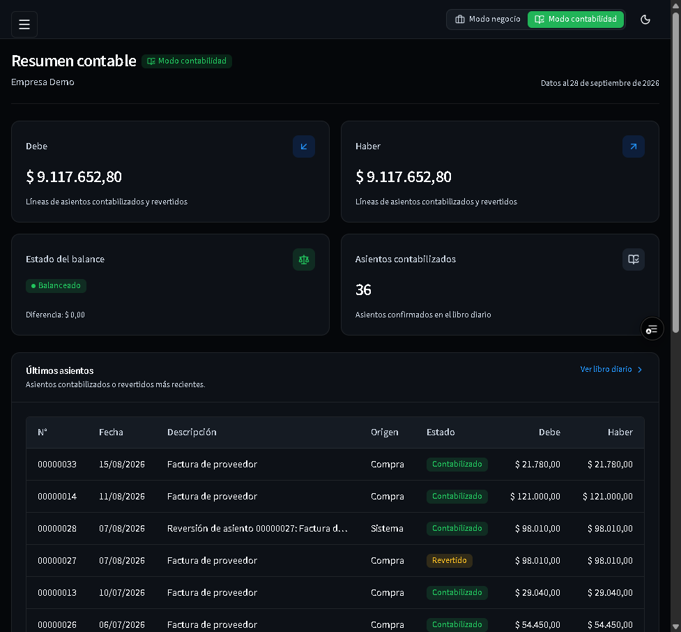

- La aplicación **recuerda el modo elegido** en ese navegador: si cerrás y volvés a entrar, sigue en el mismo modo.
- Cambiar de modo **no cambia permisos ni datos**; solo cambia la presentación.
- Si el cambio falla (por ejemplo, por un corte de conexión), aparece el aviso "No se pudo cambiar el modo." y queda el modo anterior.

### El menú según el modo

En **modo negocio**, las secciones comerciales van arriba bajo **Tu negocio**, y **Contabilidad** queda en un grupo secundario. En **modo contabilidad** pasa lo contrario: arriba van **Contabilidad** y **Reportes**, y **Clientes, Proveedores, Caja y Bancos** quedan en **Gestión comercial**. En los dos modos están todas las secciones; nada se oculta.

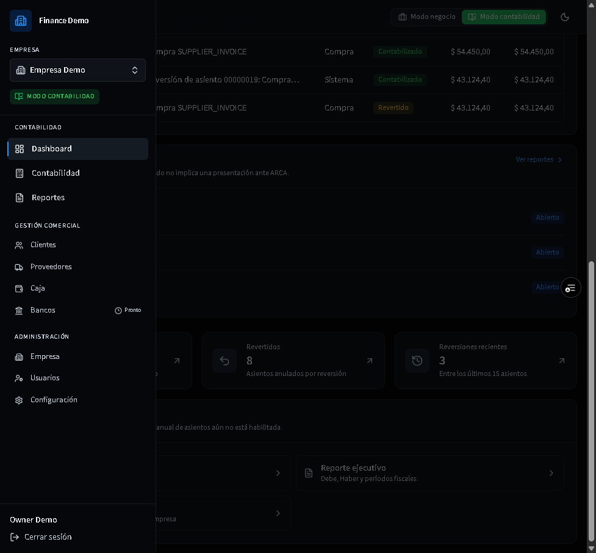

---

## 4. Dashboard en modo negocio

Es la pantalla de inicio en modo negocio. Arriba ves el nombre de la empresa, la fecha de hoy y el rango de meses con actividad registrada.

### Indicadores principales

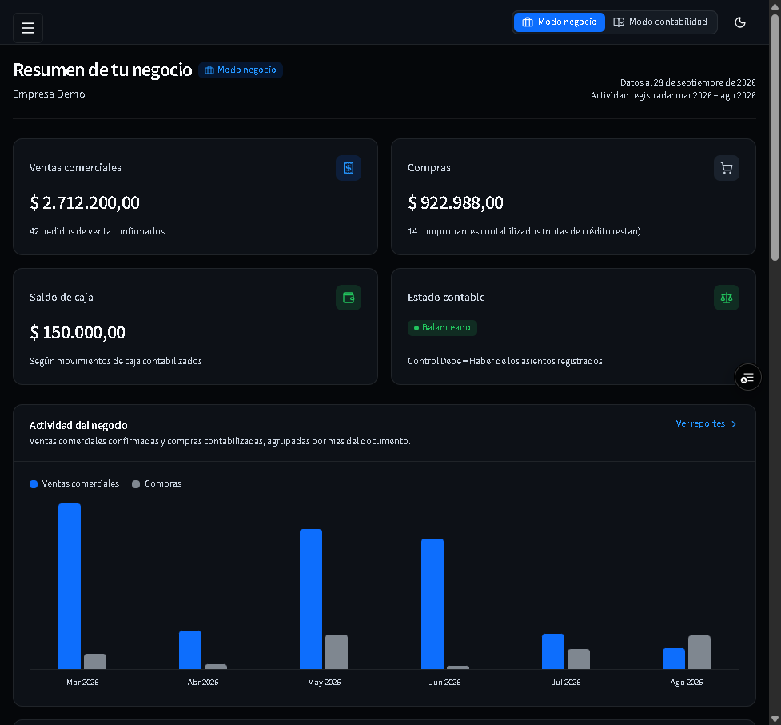

| Tarjeta | Qué muestra |
|---|---|
| **Ventas comerciales** | Suma de los pedidos de venta confirmados. No incluye presupuestos, borradores ni cancelados. |
| **Compras** | Suma de los comprobantes de proveedores contabilizados. Las notas de crédito restan. |
| **Saldo de caja** | Ingresos menos egresos contabilizados en las cuentas de caja. |
| **Estado contable** | Si el total del Debe coincide con el del Haber: **Balanceado**, **Revisar** o **Sin movimientos**. |

Cada tarjeta es un enlace: al hacer clic vas a la sección relacionada.

### Actividad del negocio

El gráfico compara, mes por mes, **ventas comerciales** (barras azules) y **compras** (barras grises), según la fecha de cada documento. Muestra hasta los últimos 6 meses con actividad. Si todavía no hay datos, aparece un mensaje en lugar del gráfico.

### Estado contable y accesos por módulo

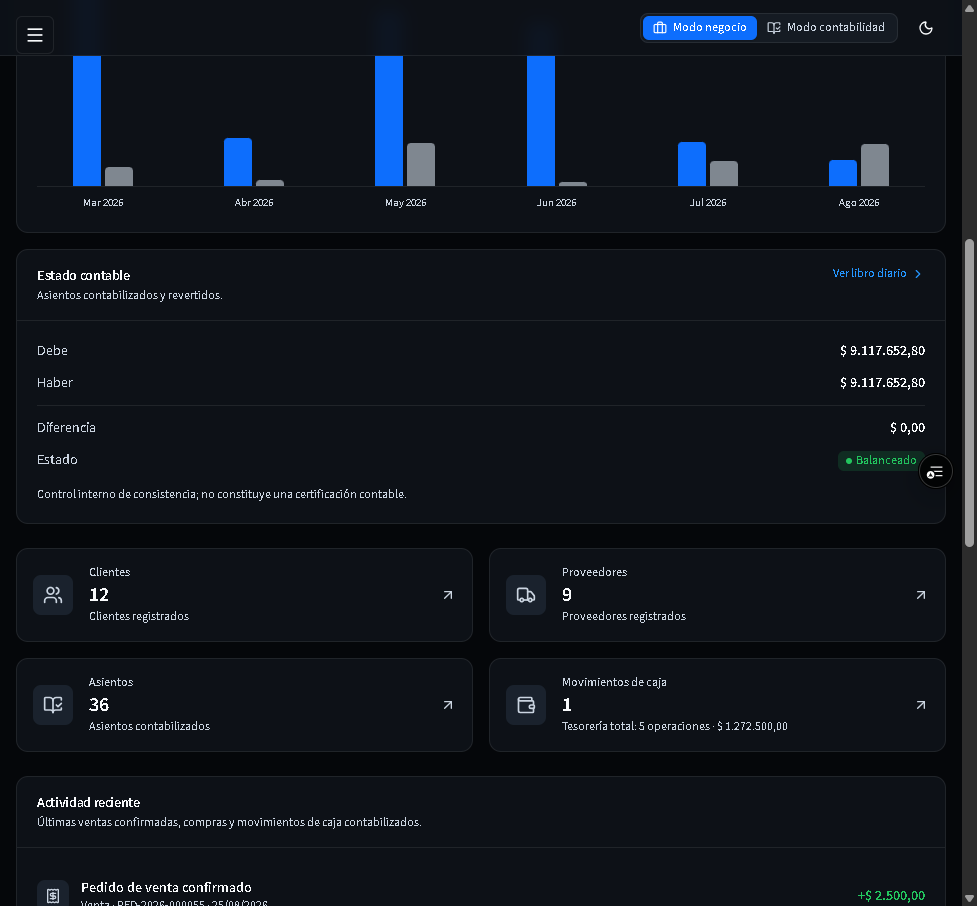

- **Estado contable** detalla Debe, Haber y la diferencia. El enlace **Ver libro diario** lleva a Contabilidad.
- Las cuatro tarjetas de abajo (**Clientes, Proveedores, Asientos, Movimientos de caja**) muestran la cantidad registrada y abren la sección correspondiente. En **Movimientos de caja** se aclara además el total de operaciones de tesorería (caja y bancos).

### Actividad reciente

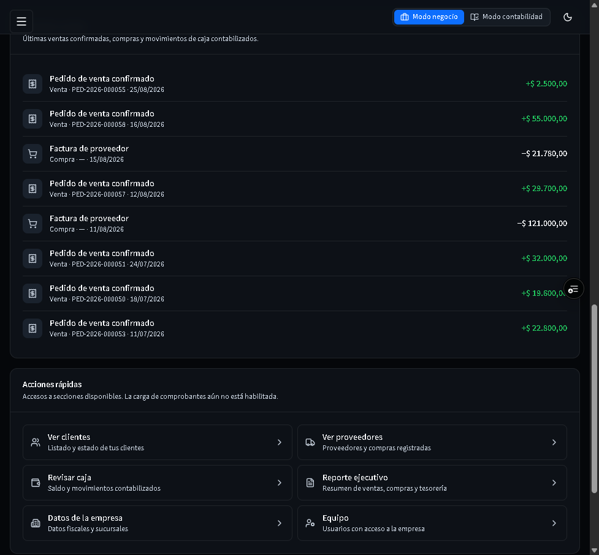

Lista las últimas ventas confirmadas, compras contabilizadas y movimientos de caja, del más nuevo al más viejo. Si un comprobante de compra no tiene punto de venta y número cargados, figura como **Sin número**. Los importes en **verde con "+"** son entradas; los importes con **"−"** son salidas.

### Acciones rápidas y configuración

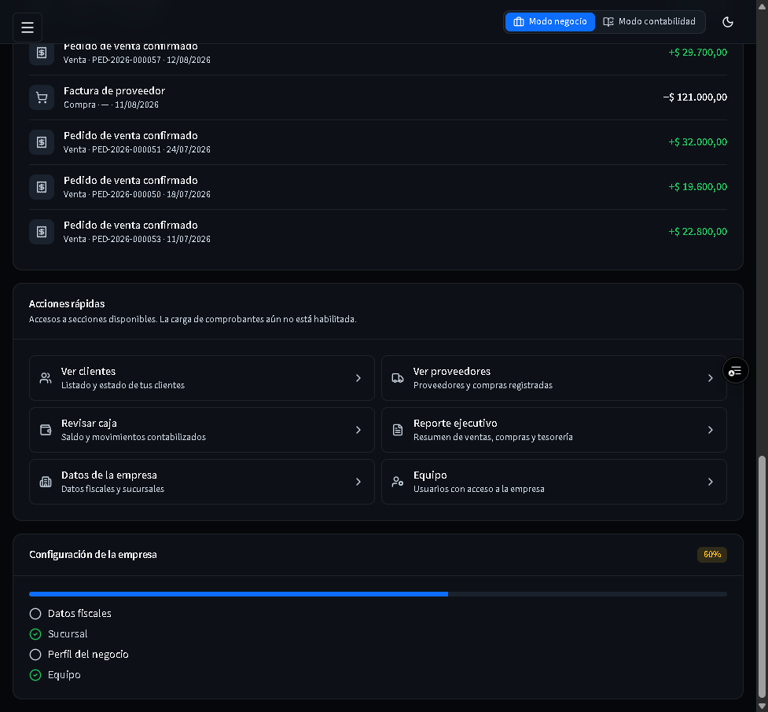

- **Acciones rápidas** son atajos a secciones existentes. No hay botones de "crear" porque la carga de comprobantes todavía no está habilitada.
- **Configuración de la empresa** muestra qué datos de alta están completos (tilde verde) y cuáles faltan (círculo vacío), con un porcentaje de avance.

---

## 5. Dashboard en modo contabilidad

Es la pantalla de inicio en modo contabilidad.

### Indicadores y últimos asientos

| Tarjeta | Qué muestra |
|---|---|
| **Debe** | Suma del Debe de las líneas de asientos contabilizados y revertidos. |
| **Haber** | Suma del Haber de esas mismas líneas. |
| **Estado del balance** | Balanceado / Revisar / Sin movimientos, con la diferencia exacta. |
| **Asientos contabilizados** | Cantidad de asientos en estado Contabilizado. |

**Últimos asientos** lista los asientos más recientes con número, fecha, descripción, origen (Compra, Venta, Sistema…), estado y los importes de Debe y Haber.

### Períodos fiscales y estado de los asientos

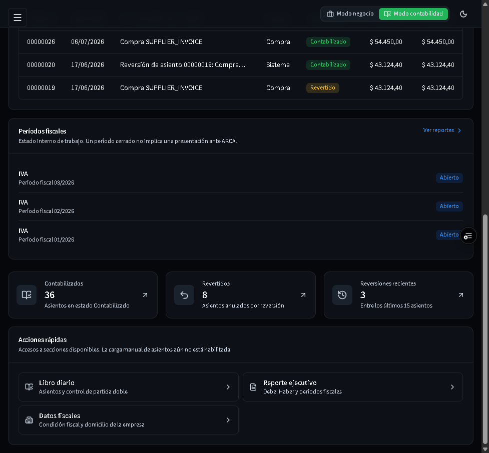

- **Períodos fiscales**: el estado interno de trabajo de cada período (Abierto, En revisión, Revisado, Cerrado, Reabierto). Un período cerrado **no** significa que se haya presentado ante ARCA.
- **Contabilizados / Revertidos / Reversiones recientes**: cuántos asientos hay en cada situación.
- **Acciones rápidas**: accesos al libro diario, al reporte ejecutivo y a los datos fiscales.

---

## 6. Cambiar de empresa

Si tu usuario pertenece a más de una empresa, en el menú lateral, bajo **Empresa**, hay un selector.

1. Abrí el selector y elegí la empresa.
2. Aparece "Cambiando de empresa…" y la página se recarga con los datos de la nueva empresa.

Todas las pantallas muestran **solo** los datos de la empresa activa. Nunca se mezclan datos de dos empresas.

Cuando una empresa todavía no tiene movimientos, la aplicación lo dice claramente en lugar de mostrar datos inventados:

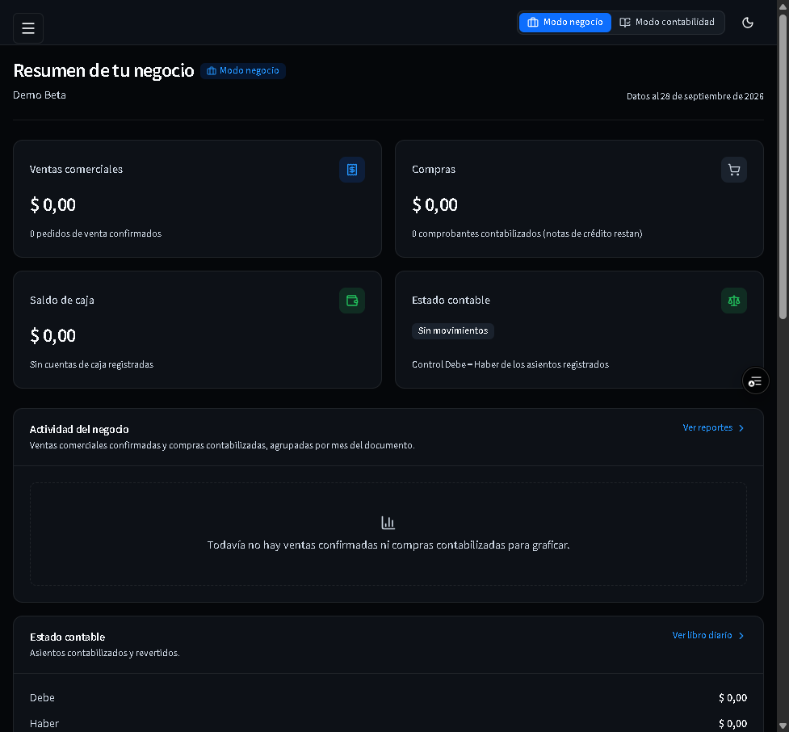

---

## 7. Clientes

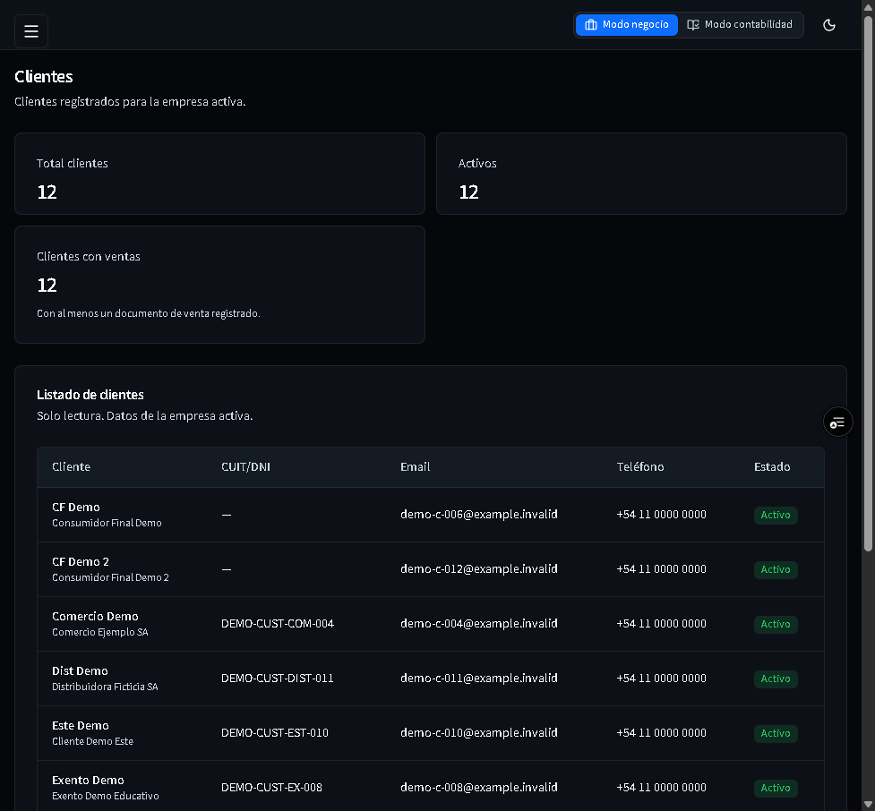

- **Total clientes**, **Activos** y **Clientes con ventas** (clientes con al menos un documento de venta).
- **Listado de clientes** con nombre comercial y razón social, CUIT/DNI, email, teléfono y estado (Activo / Inactivo).

---

## 8. Proveedores

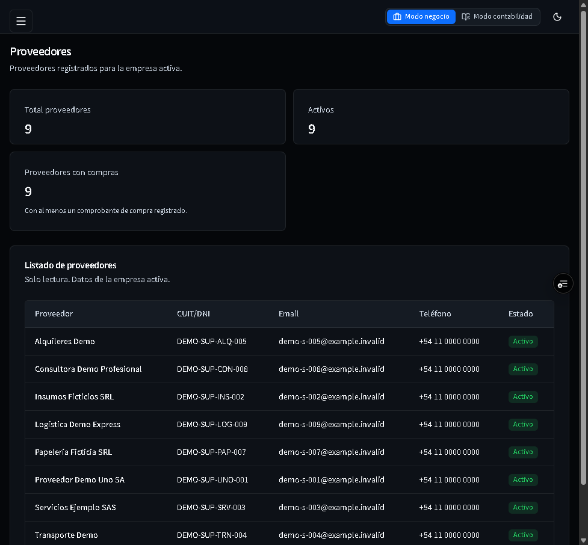

Funciona igual que Clientes: totales arriba y el listado de proveedores con sus datos de contacto y estado. **Proveedores con compras** cuenta los que tienen al menos un comprobante de compra.

---

## 9. Caja

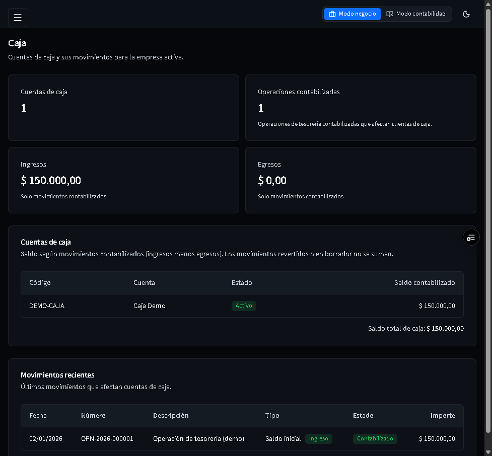

- **Cuentas de caja** y **Operaciones contabilizadas** que afectan a esas cuentas.
- **Ingresos** y **Egresos**, contando solo movimientos contabilizados.
- **Cuentas de caja**: el saldo de cada cuenta y el **saldo total de caja**. Los movimientos revertidos o en borrador no se suman.
- **Movimientos recientes**: fecha, número, descripción, tipo (Ingreso/Egreso), estado e importe.

> La caja solo incluye cuentas de tipo caja (efectivo). Las cuentas bancarias no forman parte del saldo de caja.

---

## 10. Bancos

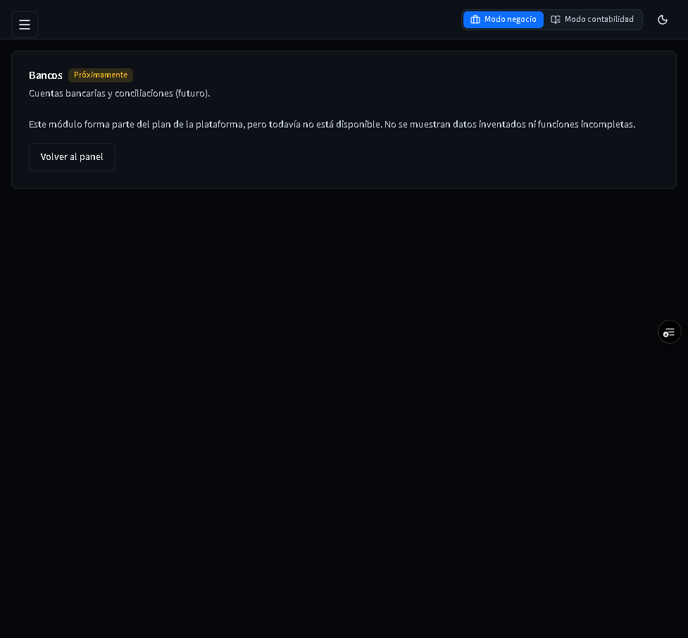

Este módulo está planificado pero **todavía no está disponible**. La pantalla lo indica con la etiqueta **Próximamente** y no muestra datos inventados. El botón **Volver al panel** te lleva al dashboard.

---

## 11. Contabilidad

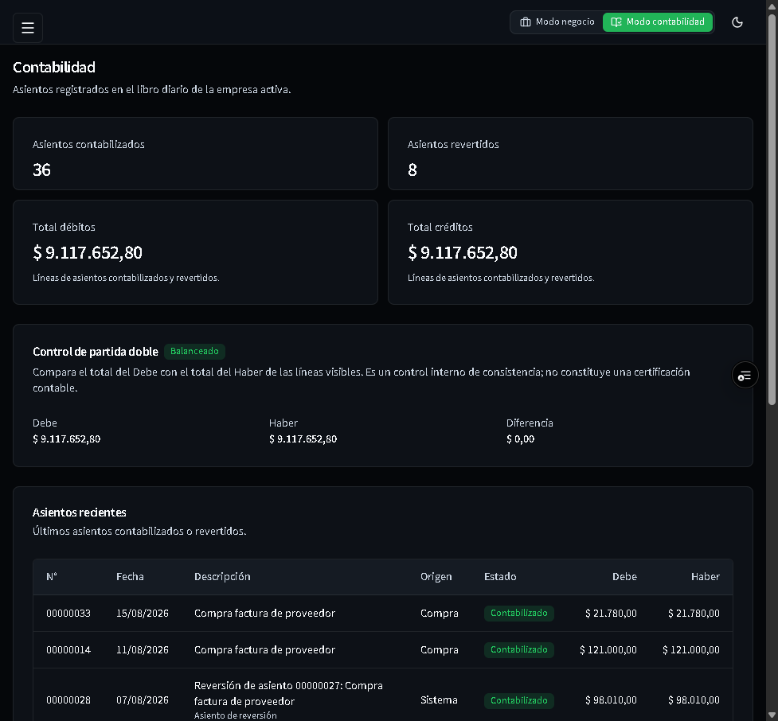

- **Asientos contabilizados** y **Asientos revertidos**.
- **Total débitos** y **Total créditos**.
- **Control de partida doble**: compara Debe contra Haber y muestra la diferencia. Es un control interno de consistencia, no una certificación contable.
- **Asientos recientes**: el libro diario con los últimos asientos. Cuando un asiento es la reversión de otro, se indica debajo de la descripción ("Asiento de reversión").

---

## 12. Reportes

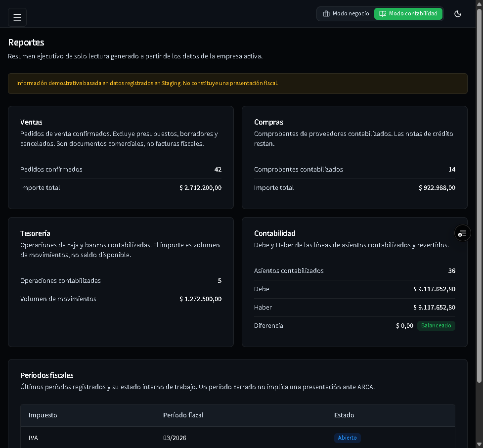

Es un resumen ejecutivo en una sola pantalla:

| Bloque | Qué resume |
|---|---|
| **Ventas** | Pedidos confirmados e importe total. Son documentos comerciales, no facturas fiscales. |
| **Compras** | Comprobantes contabilizados e importe total (con notas de crédito restando). |
| **Tesorería** | Operaciones de caja y bancos contabilizadas y su **volumen** de movimientos. Es volumen, no saldo disponible. |
| **Contabilidad** | Asientos contabilizados, Debe, Haber y diferencia. |
| **Períodos fiscales** | Últimos períodos y su estado interno. |

El recuadro amarillo recuerda que la información es demostrativa y que no constituye una presentación fiscal.

---

## 13. Administración: Empresa, Usuarios y Configuración

### Empresa

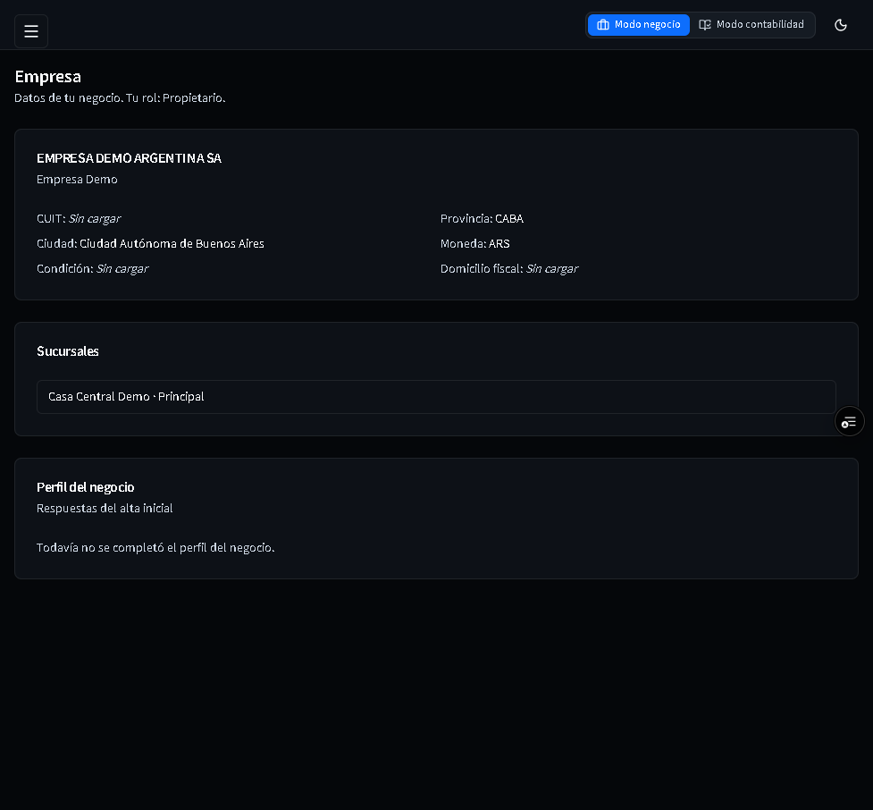

Muestra los datos de la empresa activa (razón social, nombre comercial, CUIT, provincia, ciudad, moneda, condición fiscal, domicilio), sus **sucursales** y el **perfil del negocio** cargado en el alta. También indica tu rol en esa empresa. Un guion (—) indica que el dato todavía no se cargó.

### Usuarios

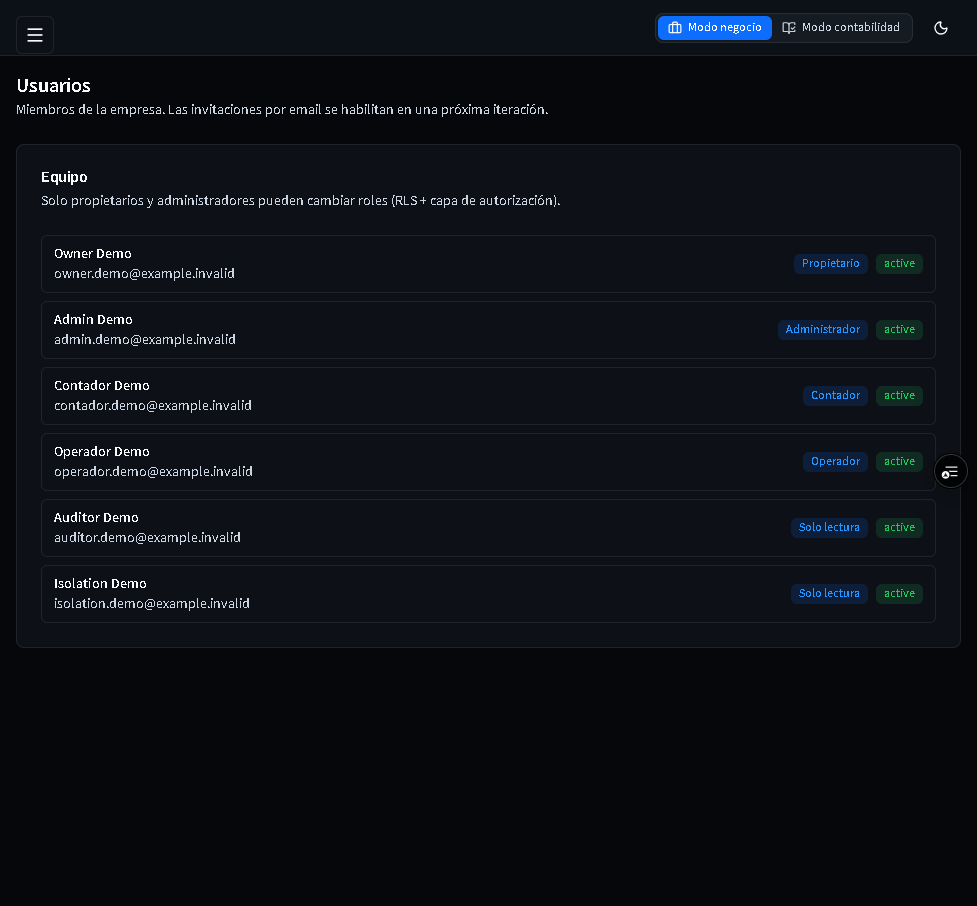

Lista las personas con acceso a la empresa, con su rol (**Propietario, Administrador, Contador, Operador, Solo lectura**) y su estado (**Activo, Invitado o Deshabilitado**). Solo propietarios y administradores pueden cambiar roles. Las invitaciones por email se habilitarán más adelante.

### Configuración

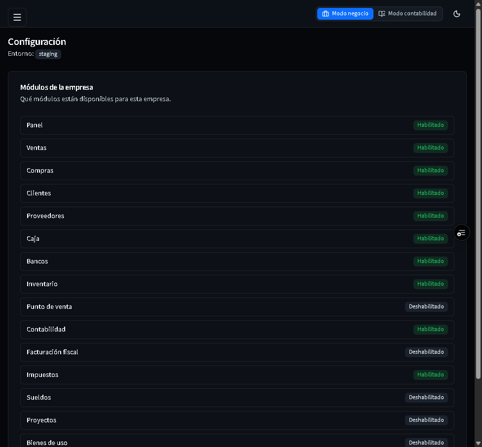

Indica el entorno (por ejemplo, **staging**) y qué **módulos** están disponibles para la empresa: **Habilitado**, **Restringido** o **Deshabilitado**.

---

## 14. Cómo leer los números

| Término | Significado |
|---|---|
| **Contabilizado** | Registro confirmado que forma parte de los totales. |
| **Revertido** | Registro anulado mediante un asiento de reversión. Se muestra para mantener la trazabilidad. |
| **Borrador** | Registro no confirmado. **No** se suma en ningún total. |
| **Pedido de venta confirmado** | Venta comercial confirmada, lista para facturar o ya facturada. Los presupuestos, borradores y cancelados no cuentan. |
| **Nota de crédito de proveedor** | Resta del total de compras. |
| **Saldo de caja** | Ingresos menos egresos contabilizados, solo en cuentas de caja. |
| **Volumen de tesorería** | Suma de importes de las operaciones de caja y bancos. No es un saldo. |
| **Balanceado** | El total del Debe es igual al total del Haber. |
| **Revisar** | Debe y Haber no coinciden; conviene revisar los asientos. |
| **Sin movimientos** | Todavía no hay asientos para controlar. |

Los importes se muestran en pesos argentinos con formato local (por ejemplo, `$ 2.712.200,00`) y las fechas como DD/MM/AAAA.

**No hay porcentajes de crecimiento ni tendencias estimadas**: todos los números se calculan a partir de registros reales de la empresa activa.

---

## 15. Mensajes que podés ver

| Mensaje | Qué significa | Qué hacer |
|---|---|---|
| **"Todavía no hay…"** | La empresa no tiene datos de ese tipo. | Nada: es un estado normal para empresas nuevas. |
| **"No pudimos cargar esta información."** | Falló la consulta de ese bloque. Nunca se reemplaza por ceros. | Recargá la página. Si persiste, avisá al soporte. |
| **"No se pudo cambiar el modo."** | No se guardó el cambio de modo. | Revisá la conexión y volvé a intentar. |
| **"Cambiando de empresa…"** | Se está cargando la otra empresa. | Esperá unos segundos. |
| **Pronto / Próximamente** | El módulo todavía no está disponible. | — |
| Bloques grises animados | La página se está cargando. | Esperá unos segundos. |

---

## 16. Preguntas frecuentes

**¿Puedo cargar una venta, una compra o un asiento?**
Todavía no. Esta versión es de solo lectura; por eso no hay botones de "Nuevo" o "Crear".

**¿Por qué el saldo de caja es distinto del volumen de tesorería?**
El saldo de caja considera solo las cuentas de caja (ingresos menos egresos). El volumen de tesorería suma los importes de todas las operaciones de caja y bancos, sin restar nada.

**¿Por qué "Ventas comerciales" no coincide con lo facturado?**
Porque cuenta pedidos de venta confirmados, que son documentos comerciales. La facturación electrónica ante ARCA no está activa en esta demo.

**Cambié de modo y el menú se reordenó. ¿Perdí alguna sección?**
No. Los dos modos tienen las mismas secciones; solo cambia el orden y cuáles se destacan.

**¿El modo elegido se aplica a toda la empresa?**
No. Se guarda en tu navegador y solo te afecta a vos.

**Tengo acceso a dos empresas. ¿Puedo ver datos de las dos a la vez?**
No. Siempre trabajás sobre una empresa activa; se cambia desde el selector del menú lateral.

**¿Puedo usar tema claro?**
Sí. Usá el botón de luna/sol en la barra superior.
